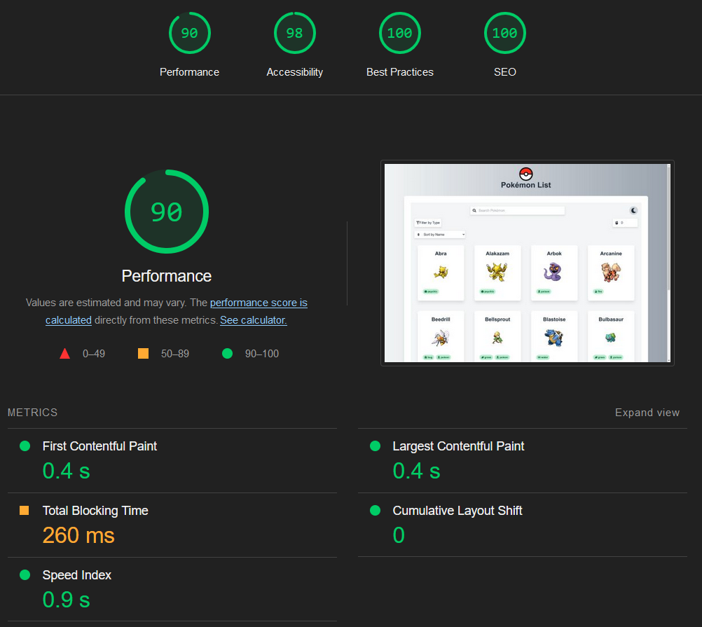

# Pokémon React App with Vite, TypeScript, GraphQL, and Chart.js

This project is a modern Pokémon web application built using the latest web technologies such as React, TypeScript, Vite, Apollo Client (for GraphQL), and Chart.js (for data visualization). The app allows users to browse and view detailed information about various Pokémon, including performance stats visualized with charts.

## Features

- **React**: A JavaScript library for building user interfaces.
- **TypeScript**: A statically typed superset of JavaScript.
- **Vite**: A fast development build tool that serves the app with hot module replacement (HMR).
- **Apollo Client**: A powerful GraphQL client for data fetching and caching.
- **Chart.js**: Library used to visualize Pokémon stats with bar and radar charts.
- **Framer Motion**: For smooth animations and transitions.
- **React Router**: For navigation between the Pokémon list and detail pages.
- **Redux**: State management, including theme toggling between light and dark mode.

## Getting Started

### Prerequisites

Ensure you have the following installed:

- **Node.js** (v14 or higher)
- **npm** or **yarn**

### Installation

Clone the repository and install dependencies:

```bash
git clone https://github.com/zied-snoussi/pokemon-app.git
cd pokemon-app
npm install
```

### Running the App

To start the development server, run the following command:

```bash
npm run dev
```

This will start the Vite development server with Hot Module Replacement (HMR). By default, the app will be available at [http://localhost:5173](http://localhost:5173).

### Building for Production

To build the app for production:

```bash
npm run build
```

This will generate an optimized build in the `dist` folder, ready for deployment.

### Linting and Formatting

To run ESLint for code linting:

```bash
npm run lint
```

To fix ESLint issues automatically:

```bash
npm run lint:fix
```

To format code using Prettier:

```bash
npm run format
```

### Testing

To run tests (if any):

```bash
npm test
```

## Technologies Used

### Core Stack

- **React**: A declarative UI library for building modern web applications.
- **TypeScript**: Type safety and improved developer experience.
- **Vite**: Next-generation build tool for fast development.
- **Apollo Client**: Fetches and manages GraphQL queries and mutations.
- **Chart.js**: Used for visualizing Pokémon stats in charts.
- **Framer Motion**: Smooth animations and transitions.

### Additional Tools

- **Redux**: Global state management to handle theme toggling (dark/light mode).
- **React Router**: For managing routing between Pokémon list and detail pages.
- **ESLint**: Linting tool for enforcing consistent coding styles and avoiding errors.
- **Prettier**: Code formatter to keep codebase clean and consistent.

## GraphQL Integration

The project fetches data using Apollo Client with GraphQL. Pokémon data is fetched from a GraphQL API.

## Light/Dark Mode

The app includes a theme toggle button that allows users to switch between light and dark modes. This is powered by Redux for state management and can be extended with additional theming options.

### Example Redux Store Configuration:

```ts
// store/themeSlice.ts
import { createSlice } from '@reduxjs/toolkit';

export const themeSlice = createSlice({
  name: 'theme',
  initialState: {
    darkMode: false,
  },
  reducers: {
    toggleTheme: (state) => {
      state.darkMode = !state.darkMode;
    },
  },
});

export const { toggleTheme } = themeSlice.actions;
export default themeSlice.reducer;
```

## Charts and Visualizations

The Pokémon details page includes charts (Bar and Radar) to visualize the Pokémon's stats, such as `base_experience`, `height`, and `weight`. This is done using `react-chartjs-2` and `Chart.js`.

## Live Demo

Check out the live demo of the app on Vercel: [Pokémon App](https://pokemon-app-beta-rouge.vercel.app/)

## Lighthouse Performance

The app has been tested with Lighthouse to ensure optimal performance, accessibility, best practices, and SEO.



## License

This project is licensed under the MIT License.

## Contact

For any inquiries, please reach out via email: `zied.alsnoussi@gmail.com`.